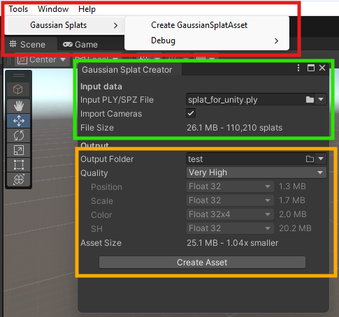
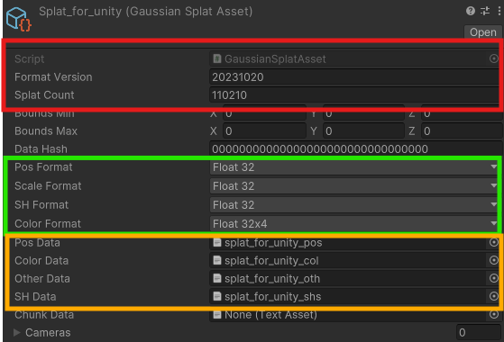
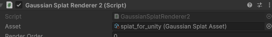
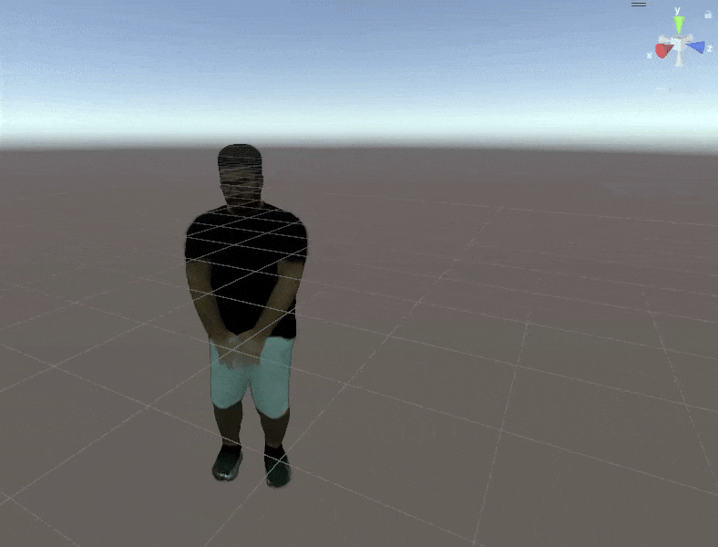

# SNAP: Solving Neural Articulated Performances

> A Unity3D player for animated Gaussian Avatars

## Asset Preparation

### 1. Gaussian Asset
It is necessary to convert the `*.ply` splat file into a Unity3D asset. Since the modified animated renderer in this repo derives from this [repo](https://github.com/aras-p/UnityGaussianSplatting), we use this tool:

1. Use the Gaussian Splat Creator tool to generate the asset.
    
    - [**red annotation**] Open the tool via `Tools/Gaussian Splats/Create GaussianSplatAsset`
    - [**green annotation**] Select the animated Gaussian Avatar file (_e.g._ `splat_for_unity.ply`)
    - [**orange annotation**] Select an output folder and choose the `Very High` quality profile
    - [**orange annotation**] Press the `Create Asset` button
2. Import the Gaussian Splat Asset into this project
    
    - Copy the files generated in the previous output folder to `/Assets/GaussianAssets/` and rename accordingly
    - [**red annotation**] Select the `.asset` file to update its corresponding script (`GaussianSplatAsset`) and its properties as indicated, with a fixed version `20231020` and the splat count being the total splats in the `*.ply` file
    - [**green annotation**] Update the formats to match the `Very High` profile settings
    - [**orange annotation**] Select the corresponding binary files for positions (`*_pos`), color (`*_col`), other (`*_oth`) and SH coefficients (`*_shs`).
3. Import the animation related files into the project
    - Copy the `joints.ply` and `skinned_mesh.ply` files from the Gaussian Avatar output folder (where `splat_for_unity.ply` was generated) into a `folder` inside `/Assets/StreamingAssets/`
4. Add the `avatar` prefab in the scene
    
    - The game object resulting from the `avatar` prefab (found in `/Assets/Prefabs/`) should be named as the `folder` in the step 3
    - Select the corresponding `*.asset` file that was imported in step 1 in the `Asset` property
5. Repeat for any number of avatars needed.

## Playback

Press `Play` and you should see the avatars bopping !
    